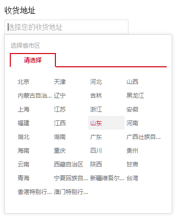
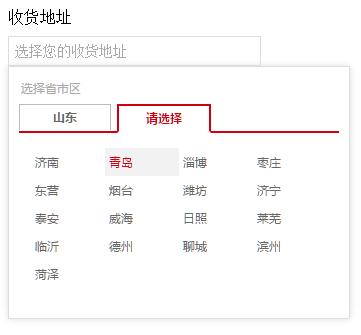
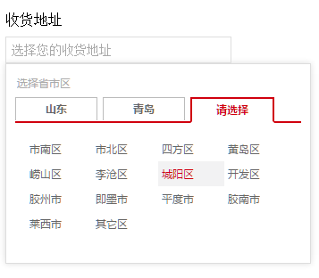

# vue-dist-picker

vue组件：中国省市区三联选择（pc端）


## 更新日志

### @1.0.0
- 我出生了


## demo

示例（vue@1.0+） [点我](http://dai-siki.github.io/vue-dist-picker/example/demo.html).


## 截图






## 依赖

基于 vue.js@1.0+ 版本，模块使用es6编写（需babel转译），css使用scss编译（需scss-loader转译）。

## 地区列表数据源
[china-dist-data](https://github.com/dai-siki/china-dist-data).

当然你可以使用自己的数据，格式与此相符即可，该组件最终需要的是一个名为“DIST_PICKER_LIST”的全局变量。


## 安装

#### npm

```shell
$ npm install vue-dist-picker china-dist-data
```

## 使用

参考示例，地区列表需要按指定的格式，并声明全局变量。

#### 相关参数

| 名称              | 类型               | 默认             | 说明                                         |
| ----------------- | ----------------- | ---------------- | --------------------------------------------- |
| value             | String            | ""               | 要双向绑定的地区Id                |
| field             | String            | ""               | 会给input标签添加name及id属性                   |
| placeholder       | String            | ""               | 你懂的                                     |


#### 示例(vue@1.0+)

```html

<div id="app">
	<label for="dist">收货地址</label>
	<dist-picker field="dist" placeholder="选择您的收货地址" :value.sync="distId"></dist-picker>
</div>

<script>
import 'babel-polyfill'; //因为使用了es6的一些方法，需要babel垫片，如果你项目中已有相关兼容性方案，可忽略
import distList from 'china-dist-data';
import Vue from 'vue';
import myDistPicker from 'vue-dist-picker';

//注册一个地区列表全局变量（考虑到distList会比较大，如项目中多次使用，单独为一个js文件比较好）
window.DIST_PICKER_LIST = distList;

new Vue({
	el: '#app',
	data: {
		distId: ''
	},
	components: {
		'dist-picker': myDistPicker
	}
});

</script>

```
